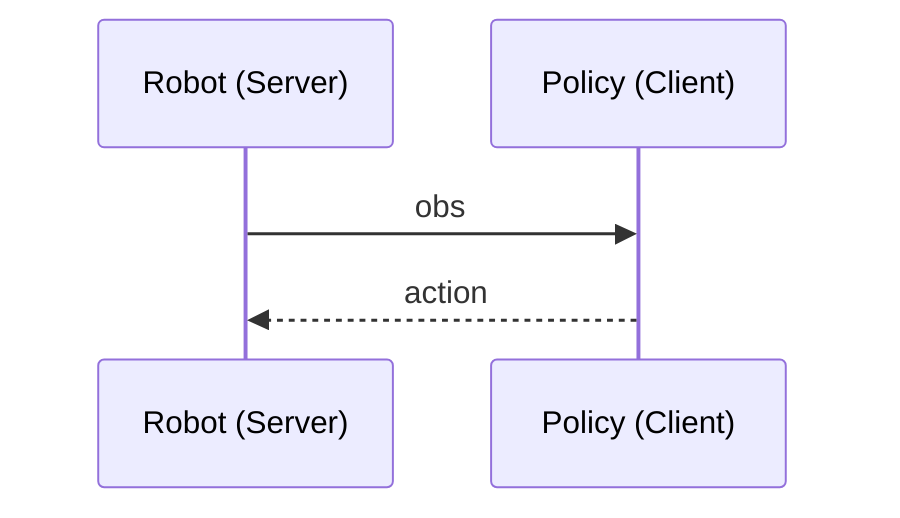

# Policy Server and Client

## 一键安装环境

在项目根目录执行：

```bash
bash install_env.sh
```

默认会创建`.venv`虚拟环境并安装`pyproject.toml`中的全部依赖。

如果你希望指定虚拟环境目录：

```bash
bash install_env.sh .venv_custom
```

安装完成后激活：

```bash
source .venv/bin/activate
```

## 工作流程




## How to use?

### 运行已有测试
已有测试的配置文件请见`./config/`目录下

推荐用法：

For **server**:

在终端运行：
```bash
bash test_server.sh --host 0.0.0.0 --port 9000
```

这会启动一个固定 JSON 控制通道。server 不再需要本地指定 `--all` 或 `test_num`，而是等待 client 把每轮测试配置发过来。

For **client**:

在终端运行：
```bash
bash test_client.sh test_num --host localhost --port 9000
```

`test_num`代表测试序号,可选1~15

例如：
```bash
bash test_client.sh 1 --host localhost --port 9000
```

> [!NOTE]
>
> `--port` 现在默认表示 **server 控制端口**。
> client 会先通过控制通道把 `config` 发给 server，收到动态分配的数据端口后，再发起真正的 TCP / Web / UDP 测试连接。

### 一次跑完全部测试配置

如果希望 server 和 client 各启动一次，就顺序跑完 `./config/test_*.yml` 下的全部测试，可以分别执行：

For **server**:
```bash
bash test_server.sh --host 0.0.0.0 --port 9000
```

For **client**:
```bash
bash test_client.sh all --host localhost --port 9000
```

如果只想在批量模式下跑 `is_jpeg: true` 的配置：
```bash
bash test_client.sh all --host localhost --port 9000 --jpeg-only
```

也可以直接用 Python 参数形式：
```bash
python test_server.py --host 0.0.0.0 --port 9000
python test_client.py --all --host localhost --port 9000
python test_client.py --all --host localhost --port 9000 --jpeg-only
```

> [!NOTE]
>
> server 端不再需要 `--all`。
> 批量顺序完全由 client 控制：`test_1.yml -> test_2.yml -> ...`
> client 会先发控制消息，再按 server 返回的数据端口建立真实连接。

### 兼容旧模式

如果你已经手动起好了某一个数据通道 server，也可以让 client 跳过控制通道，直接连接：

```bash
bash test_client.sh 1 --host localhost --port 7001 --direct
```

server 端旧的本地模式也还保留：

```bash
bash test_server.sh 1 --host 0.0.0.0 --port 7001
bash test_server.sh all --host 0.0.0.0 --port 7001
```

### 自定义测试

For **server**:

1. 在 `./config/` 下准备配置文件，只保留本次测试的**协议 (`protocol`)**、**序列化方法(`packaging_type`)**、测试文件等测试参数
2. 运行测试: `python test_server.py --host 0.0.0.0 --port 9000`

For **client**:

1. 在配置文件中指定本次测试的**协议 (`protocol`)**、**序列化方法(`packaging_type`)**；连接地址通过启动参数传入
2. 等待server启动运行后，运行测试: `python test_client.py --host localhost --port 9000`

> [!NOTE]
>
> 现在 `config/*.yml` 不再保存 `server/client` 的 `host/port`。
> 控制通道地址统一通过命令行参数 `--host` 和 `--port` 传入。


## 注意事项

### 格式转化
Be carefull: 

- Cannot do: np.bytes -> json
- Can do: bytes -> json

### 服务器端口不可用：利用隧道
在本地的一个终端输入
```bash
ssh -p 6361 -L 9000:localhost:9000 root@120.48.23.252
```
> [!NOTE]
>
> **参数解析：**
>
> `9000:localhost:9000` 中：
>
> 左边的`9000`是本地的 TCP socket 或 Web socket 所用的端口
>
> 右边的`9000`是服务器的 TCP socket 或 Web socket 所用的端口
>
> 这两个数字**可以不同**。
>
> `-p 6361` 是指服务器的ssh端口，比如下面这样：
>
> ```bash
> Host baidu_a800
>     HostName 120.48.23.252
>     Port 6361
>     User root
> ```

然后在另一个终端启动对应的 client 程序

> [!CAUTION]
>
> 注意： 将服务器的公网IP换成`localhost`
>
> 对于`web_client.py`: `server_url` 不是用`"ws://120.48.23.252:9000"`，而是`"ws://localhost:9000"`
>
> 对于`tcp_client.py`: `host`不是用`120.48.23.252`，而是`localhost`

## TODO

- [x] 添加测试代码：从config/yaml中读取配置，然后调用src里的类
- [x] shell文件，实现一键测试，类似于操作系统比赛的测例一样 -> 失败，原因：两个脚本无法同步执行每个测试。这个同步需要人来完成。
- [x] 加入UDP -> 已经能通信，但是由于3个图像帧太大，所以要想模拟实际传输数据还需要**人为分片**！
- [x] UDP**人为分片**！
- [x] 整理好result的结构
- [x] UDP加入整体架构中
- [x] UDP测试
- [x] 加入序列化方法的抽象类,并将json,msgpack,pickle写成类，继承这个抽象类

## 知识

对于一个线程：

- 不用`async`: 对于多个连接的请求，只能逐个**串行**
- 使用`async`: 对于多个连接的请求，可以**并发**执行（ 执行模式：一个线程，多个协程，事件循环调度）

对于多个线程或者多个进行：

不用`async`也可以并发执行
